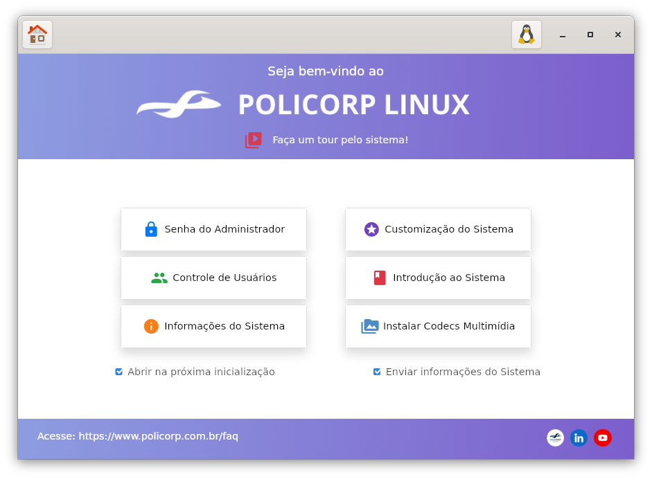

# Policorp Linux Welcome

O **Policorp Linux Welcome** é uma aplicação de boas-vindas desenvolvida para orientar novos utilizadores no seu primeiro login no sistema Policorp Linux. A aplicação fornece acesso rápido a recursos úteis, configurações do sistema, manuais e ferramentas de recuperação.

## Funcionalidades
* **Detecção de Ambiente:** Ajusta automaticamente o conteúdo dependendo se o sistema está a correr em modo *Live* ou instalado.
* **Temas:** Suporte a temas Claro e Escuro, detectados automaticamente através das configurações do GNOME (`org.gnome.desktop.interface`).
* **Informações do Sistema:** Exibe detalhes sobre o hardware, distribuição e estado da bateria.
* **Ferramentas:** Links rápidos para configuração de utilizadores, backups e recuperação do sistema.

## Mantenedor
* **Edson Drosdeck** <edson.drosdeck@policorp.com.br>
* **Website:** [www.policorp.com.br](https://www.policorp.com.br)

## Instalação e Dependências
As dependências necessárias para a execução do projeto estão listadas no ficheiro de controlo Debian.

### Dependências de Execução
gir1.2-gtk-3.0
gir1.2-webkit2-4.1
pkexec
python3
python3-apt
python3-gi
python3-notify2
xdotool
whois

# Instalação para Desenvolvimento
- 1. Instalar dependências do sistema

sudo apt install gir1.2-webkit2-4.1 python3-notify2 python3-apt xdotool whois sassc

- 2. Clonar o repositório

git clone [https://github.com/policorp-dev/policorp-welcome.git](https://github.com/policorp-dev/policorp-welcome.git)

cd policorp-welcome

- 3. Compilar os ficheiros CSS (Sass)

bash sassc-compile.sh

./policorp-linux-welcome

# Licença
- Este projeto é software livre; pode redistribuí-lo e/ou modificá-lo sob os termos da GNU General Public License (GPL) versão 2 ou superior.
- Consulte o ficheiro debian/copyright incluído neste repositório para mais detalhes.